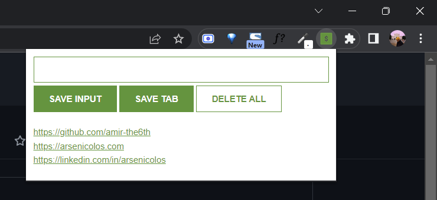

# My Pinboard - Chrome Extension

> Note: This extension is supported on other browsers than Chrome, but the Save Tab functionality is exclusively available for Chrome users due to the use of Chrome API for reading the URL of active browser tab.

This is my solution to a course project at Scrimba [JavaScript course](https://scrimba.com/learn/learnjavascript). This Google Chrome extension is a pinboard of links that user finds instructive when they are surfing the web. With this simple extension, the user can add a URL to their pinboard manually or they can also save the active tab in their browser to the pinboard.

## Table of contents

- [Overview](#overview)
  - [Links](#links)
  - [Demo](#demo)
  - [Screenshot](#screenshot)
- [My process](#my-process)
  - [Built with](#built-with)
  - [What I learned](#what-i-learned)
- [Author](#author)
- [Acknowledgments](#acknowledgments)

## Overview

### Links

- Solution URL: [Link](https://github.com/amir-the6th/Amir-Pinboard-Chrome-Extension)
- Live Site URL: [Link](https://preeminent-starship-7952bf.netlify.app/)

### Demo
(Click on the GIF if the quality seems low)

### Screenshot

## My process

### Built with

- HTML5
- CSS
- JavaScript

### What I learned

Above all things, I learned how to create a browser extension, which happened to be not difficult as I imagined it would be.
During this guided project, I learned and refreshed my mind about the following topics:
- `const`
- `addEventListener()`
- `innerHTML`
- `input.value`
- function parameters
- template strings
- `localStorage`
- The JSON object
- objects in arrays
- Chrome API

## Author

- Website - [Amir Sabagh](https://arsenicolos.com)
- GitHub - [@amir-the6th](https://github.com/amir-the6th)
- LinkedIn - [Amir Sabagh](https://linkedin.com/in/arsenicolos)

## Acknowledgments

I want to give a shout-out to the [Scrimba](https://scrimba.com) CEO and professor, Per Harald Borgen([@perborgen](https://github.com/perborgen)). I recently finished the [HTML and CSS](https://scrimba.com/learn/htmlandcss) course on Scrimba and am currently pursuing the follow-up course, [Learn JavaScript for Free](https://scrimba.com/learn/learnjavascript).